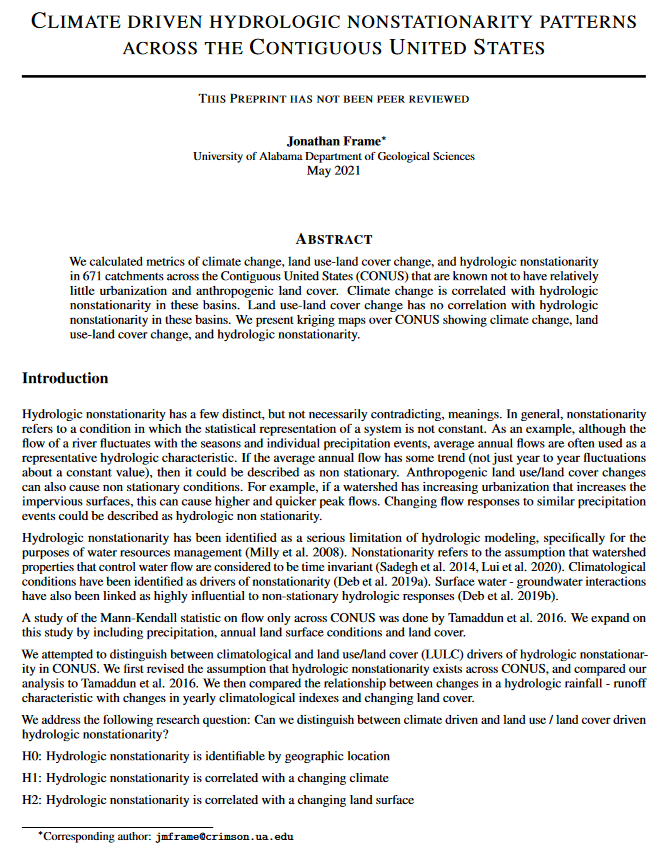

# Climate Driven Hydrologic Nonstationarity Patterns across the Continental United States
This repository contains the code and data for the research project "Climate Driven Hydrologic Nonstationarity Patterns across the Continental United States". The project investigates the impact of climate change and land use-land cover change on hydrologic nonstationarity in various catchments across the Continental United States (CONUS).

## Contents
### Google Earth Engine scripts
 - **ECMWF climate reanalysis data** `gee_export_ecmwf.js`
 - **forest cover** `gee_export_forest.js`
 - **impervious surface data**  `gee_export_impervious.js`
 - **generating maps** `gee_maps.js`
### Python scripts
- **Mann-Kendall statistical analysis** `mannkendal.py`
- **Run the Mann-Kendall** `run_mk.py`
- **Regression analysis code** `regression_qp.ipynb`
- **Add the land use land cover results to Mann Kendal analysis** `add_lulc_to_mk_results.py`
- **Summarize the nonstationarity**  `stationaritySummary_MannKendal_.py`
### Other
 - attributes_with_NWM_LSTM_PP.csv
 - calc_error.txt
 - calc_output.txt
 - job
 - results-mk-lc.txt
 - results-mk-runoff-ratio.txt
 - results-mk.txt
 - usgs_site_info.csv

### License
This project is under a proprietary license. Please see LICENSE.md for more details.
Citation
 - **Proprietary license for the code and data.** `LICENSE.md`

## Directories
Directories containing various data and results used in the study.
- ecmwf
- lulc
- maps
- nldas_precipitation
- pq
- usgs_streamflow

## Usage

To use the scripts in this repository, follow these steps:
 - Clone the repository to your local machine.
 - Ensure you have the necessary Python environment to run the scripts. Dependencies include pandas, numpy, matplotlib, and other standard scientific Python packages.
 - For Google Earth Engine scripts, you need access to Google Earth Engine and the necessary setup to run JavaScript-based scripts.
 - The preprint.pdf file contains the research paper associated with this project.

## Citation

If you use the code or data from this project, please cite the associated [research paper](./preprint.pdf). The citation guide can be found in LICENSE.md.
